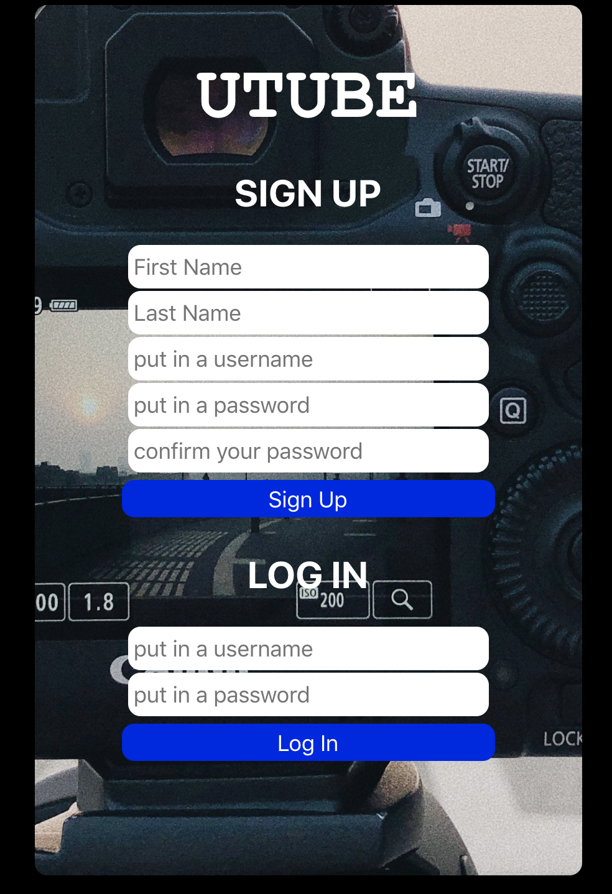
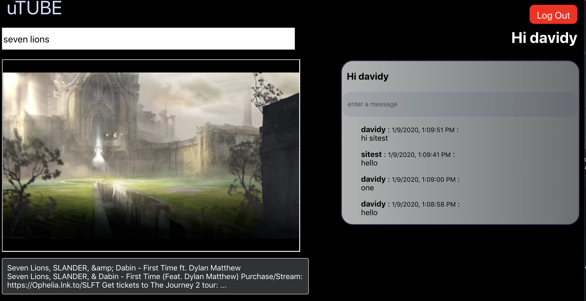

## Utube App

     

the Utube App is a video app that allows you to search for videos from youtube.com based on the keyword entered into the search bar. 

     

This app was created with MERN.

By using MongoDB as the database we are able to capture the user info when they successfully signs up and by using password hashing we are able to strengthen the security for the users. 

Another feature on the app is the ability to have real time chat globally with all users in one chat box. This was allowed by implementing socket.io.

Deployed Link: https://utube-project.herokuapp.com/
